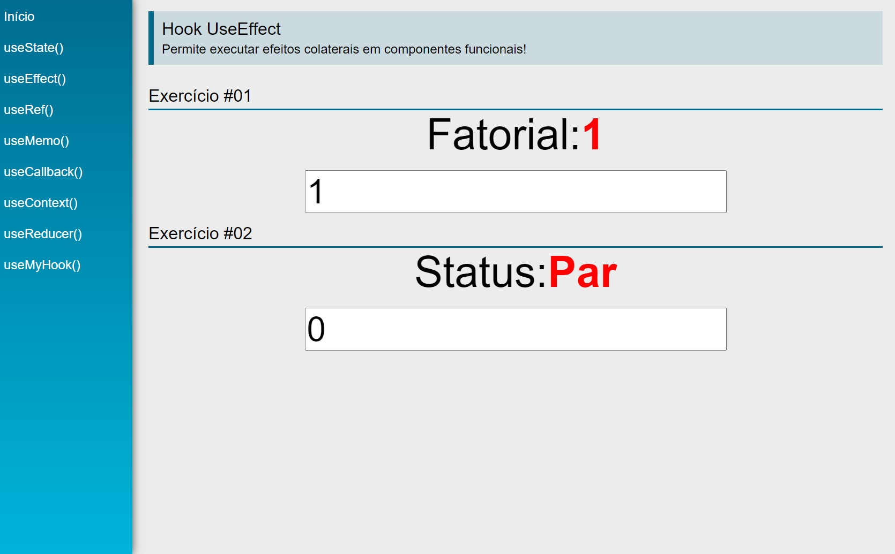
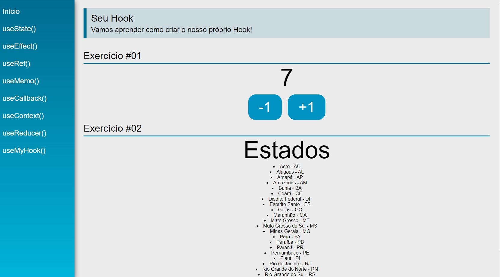

<h4 align="center"> 
	🚧 React Hooks 🚀
</h4>   

 
   
   

 

## 🎨 Projeto

- Criado um layout para demonstrar os fundamentos do react hooks na prática.

## 💻 Tarefas

- [x] 1. Introdução do Módulo
- [x] 2. Configuração de Projeto: `npm i -g create-react-app` e `create-react-app react-hooks` 
- [x] 3. useState
- [x] 4. useEffect
- [x] 5. useRef
- [x] 6. useMemo
- [x] 7. useCallback 
- [x] 8. porque usar context API
- [x] 9. useContext
- [x] 10. useReducer
- [x] 11. Custom Hooks
- [x] 12. Conclusão do Módulo

## 🚀 Seções 

- [x] Layout e lógica [60 - 81] 

## 🚀 Construído o projeto 

- favicon hooks
- título da página
- idioma da página
- fonts google roboto via link
- componente funcional em react com [hooks](https://reactjs.org/docs/hooks-intro.html) 

## 📝 Licença

Este projeto esta sobe a licença MIT.

Feito com ❤️ por Douglas A B Novato 👋🏽 [Entre em contato!](https://www.linkedin.com/in/douglasabnovato/)
 
Fonte do projeto Por Leonardo Moura Leitão no [Curso React + Redux: Fundamentos e 2 Apps do Absoluto ZERO!](https://www.udemy.com/course/react-redux-pt/), [Cod3r](https://www.cod3r.com.br/), [Github Cod3r](https://github.com/cod3rcursos/curso-react-redux)
